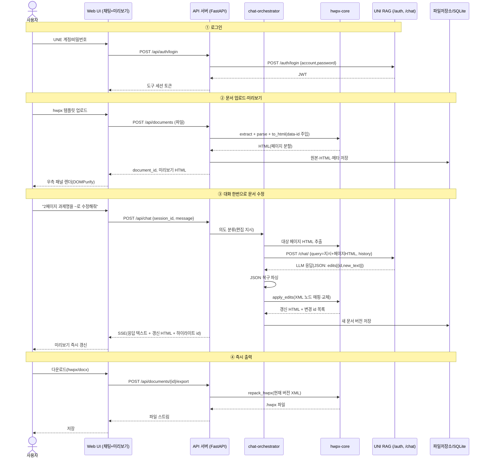

# 시스템 설계서 — LLM 대화 기반 hwpx 문서 생성·편집 도구

- 작성일: 2026-07-11
- 근거 문서: `개발 배경 및 목적.txt`(요구 원본), `docs/analysis.md`(Phase 1 조사 분석)
- 성격: "재난 계획서 생성도구" 고도화를 위한 **독립형 PoC → 실사용 도구**. 기존 시스템에 붙이지 않는다.

---

## 1. 시스템 개요

사용자가 웹 화면에서 LLM과 **대화 한번으로** hwpx 문서를 생성·수정하고, 결과물(hwpx, 가능 시 docx)을 **즉시 미리보기·다운로드**하는 도구.

핵심 설계 원칙 (Phase 1 분석 결론의 반영):

1. **HWPX ↔ HTML 왕복 편집** (process-gpt-office-mcp 방식 응용): 서버가 hwpx를 HTML로 변환(`data-id` 앵커 주입)해 브라우저는 HTML만 렌더하고, LLM은 `edits: [{id, new_text}]` 부분 수정만 반환하며, 저장 시 변경분을 원본 XML 노드에 적용해 재압축한다. 원본 서식 보존과 프론트 단순화를 동시에 얻는 검증된 구조.
2. **템플릿 우선**: 무에서 생성하기보다 표준 양식(hwpx 템플릿)의 XML을 최소 수정한다. 호환성 리스크 최소화.
3. **외부 hwpx 라이브러리 최소 의존**: 코어는 표준 라이브러리(zipfile+lxml/ElementTree) 기반 자체 모듈(office-mcp 응용). 무템플릿 신규 생성만 python-hwpx 보조.
4. **경량 독립형**: DB는 SQLite, 파일은 로컬 디스크. Supabase/Neo4j 같은 인프라 없이 단일 서버 프로세스로 동작.

## 2. 기능 요구사항 (모듈별)

모듈은 독립 교체·업데이트 가능하도록 패키지 단위로 분리한다.

### M1. hwpx-core (문서 엔진) — `app/core/hwpx/`

| ID | 요구사항 | 우선순위 |
|---|---|---|
| M1-1 | hwpx 압축 해제/재압축 (원본 압축 메타·파일 순서 보존) | 필수 |
| M1-2 | section XML 파싱 → 내부 노드 모델 (hp:p, hp:tbl, hp:pic, lineseg) | 필수 |
| M1-3 | hwpx → HTML 변환: charPr/paraPr→CSS 매핑, 페이지(`.page`) 분할, 문단·셀 순차 `data-id` 주입, 이미지 base URI | 필수 |
| M1-4 | 편집 적용: `edits[{id, new_text}]` → 전역 data-id로 XML 노드 매핑 → 텍스트 교체 (스타일 태그 보존) | 필수 |
| M1-5 | 편집된 HTML 전체 → hwpx 재패키징 (`save_from_html`) | 필수 |
| M1-6 | placeholder 잔존 검증 (미채움 빈칸 리포트) | 필수 |
| M1-7 | 표 무결성 청킹 (같은 표의 셀 분할 금지 — LLM 컨텍스트 구성용) | 권장 |
| M1-8 | 무템플릿 신규 hwpx 생성 (python-hwpx 빌더) | 선택 |

### M2. docx-core — `app/core/docx/`

| ID | 요구사항 | 우선순위 |
|---|---|---|
| M2-1 | 편집 결과의 docx 동시 출력 (python-docx) | 권장 |
| M2-2 | docx → HTML 미리보기 | 선택 |

### M3. llm-client (UNI RAG 연동) — `app/llm/`

| ID | 요구사항 | 우선순위 |
|---|---|---|
| M3-1 | `POST /auth/login` (UNE 계정) → JWT 획득·보관, 401 시 재로그인 | 필수 |
| M3-2 | `POST /chat/` 호출 래퍼: `history` 배열 방식(stateless), `model_key=qwen3-coder-next` 기본 | 필수 |
| M3-3 | SSE 스트리밍 수신 → 프론트로 중계 | 권장 |
| M3-4 | LLM JSON 출력 복구 파서 (completion의 CustomJsonOutputParser 응용: 트레일링 콤마 등 깨짐 복구, 실패 시 1회 재요청) | 필수 |
| M3-5 | API 장애/타임아웃 에러 처리 및 사용자 안내 | 필수 |
| M3-6 | LLM 백엔드 추상화 (UNI RAG 외 OpenAI 호환 엔드포인트로 교체 가능하게) | 권장 |

### M4. chat-orchestrator (대화→편집 변환) — `app/services/`

| ID | 요구사항 | 우선순위 |
|---|---|---|
| M4-1 | 사용자 발화 의도 분류: 문서 편집 지시 / 문서 생성(채움) 요청 / 일반 질문 | 필수 |
| M4-2 | 편집 지시 → 대상 페이지 HTML + 지시문을 LLM에 전달 → `edits[{id,new_text}]` JSON 수신 → M1-4 적용 | 필수 |
| M4-3 | 템플릿 채움: 문서 청크(M1-7) + 사용자 제공 내용 → 청크별 채움 데이터 생성 → 일괄 적용 | 필수 |
| M4-4 | 부분 선택 편집: 프론트가 보낸 선택 `data-id` 목록 + 지시문 처리 | 권장 |
| M4-5 | 대화 히스토리 관리 (세션별, DB 저장) | 필수 |

### M5. api (백엔드 서버) — `app/api/`

| ID | 요구사항 | 우선순위 |
|---|---|---|
| M5-1 | REST + SSE 엔드포인트 (7절 인터페이스 정의) | 필수 |
| M5-2 | 파일 저장소 관리 (업로드 템플릿, 생성본, 버전) | 필수 |
| M5-3 | 사용자 인증 (UNE 계정 위임 로그인, 도구 자체 세션) | 필수 |

### M6. web-ui (프론트엔드) — `web/`

| ID | 요구사항 | 우선순위 |
|---|---|---|
| M6-1 | 좌측 채팅 + 우측 문서 미리보기(아티팩트 패널, 리사이즈) 레이아웃 | 필수 |
| M6-2 | 서버 변환 HTML 렌더 (**DOMPurify sanitize 필수** — 원본 process-gpt-vue3의 미비점 보완) | 필수 |
| M6-3 | 문서 생성/수정 시 패널 자동 갱신 + 변경 부위 하이라이트 | 필수 |
| M6-4 | hwpx(및 docx) 다운로드 — 지연 저장(다운로드 시점에 재패키징) | 필수 |
| M6-5 | 요소 클릭/드래그 선택 + 지시문 입력(부분 편집) | 권장 |
| M6-6 | LLM 응답 SSE 스트리밍 표시 | 권장 |

## 3. 서비스 시나리오

**시나리오 A — 표준 양식 채움 (주 시나리오)**
재난 계획서 담당자가 표준 hwpx 양식을 업로드 → "이 양식으로 ○○시설 재난대응 계획서 초안 작성해줘. 시설 개요는 …" → 도구가 양식의 빈칸/placeholder를 파악하고 LLM으로 채움 데이터 생성 → 우측 패널에 완성 초안 미리보기 → 사용자가 "담당자를 홍길동으로 바꿔줘" 추가 지시 → 즉시 반영 → hwpx 다운로드 → 한컴오피스에서 열어 확인.

**시나리오 B — 기존 문서 대화 수정**
기존 hwpx 문서를 업로드 → "2페이지 과제명을 'hwpx 문서 생성 고도화'로 수정해줘" → 해당 페이지의 `data-id` 요소 텍스트만 교체되어 미리보기에 하이라이트 → 다운로드 시 원본 서식 그대로 재패키징.

**시나리오 C — 부분 선택 편집**
미리보기에서 표의 특정 셀을 드래그 선택 → "이 부분을 더 격식 있는 문장으로" → 선택된 `data-id`만 대상으로 LLM 수정 → 적용.

**시나리오 D — 일반 질의 (RAG)**
"풍수해 대응 매뉴얼에서 대피 기준이 뭐야?" → UNI RAG의 지식 검색 응답을 채팅으로 표시 (문서 수정 없음). 응답 내용을 이어서 "그 내용으로 3장 채워줘"처럼 문서에 반영 가능.

## 4. 사용자 시퀀스 다이어그램



## 5. 시스템 아키텍처 및 기술 스택 (확정)

```
┌────────────────────────── 사용자 브라우저 ──────────────────────────┐
│  Web UI (Vue 3 + Vite 경량 SPA)                                      │
│  좌: 채팅(SSE)  |  우: 문서 미리보기(HTML, DOMPurify, data-id 선택)  │
└───────────────▲──────────────────────────────────────────────────────┘
                │ REST + SSE
┌───────────────┴──────────────────────────────────────────────────────┐
│  API 서버 — Python 3.11+ / FastAPI (단일 프로세스, uvicorn)          │
│  ┌─────────────┐ ┌──────────────────┐ ┌───────────────────────────┐  │
│  │ M5 api      │→│ M4 orchestrator  │→│ M3 llm-client             │──┼──► UNI RAG System
│  └─────────────┘ └──────┬───────────┘ │ (auth/JWT, chat, JSON파서)│  │    221.147.100.161:8000
│                         ▼             └───────────────────────────┘  │    (/auth/login, /chat/)
│  ┌─────────────────────────────┐ ┌──────────────┐                    │
│  │ M1 hwpx-core (zip+XML 조작) │ │ M2 docx-core │                    │
│  └─────────────┬───────────────┘ └──────────────┘                    │
│                ▼                                                      │
│  SQLite (세션·메시지·문서 메타·버전)  +  로컬 파일저장소 (data/files/)│
└──────────────────────────────────────────────────────────────────────┘
```

| 구분 | 확정 스택 | 근거 |
|---|---|---|
| 언어/런타임 | Python 3.11+ | office-mcp·python-hwpx·python-docx 생태계와 일치 |
| 백엔드 | FastAPI + uvicorn | UNI RAG·completion과 동일 계열, SSE 지원 |
| hwpx 엔진 | 자체 모듈 (표준 lib zipfile + lxml, office-mcp 응용) + python-hwpx(보조) | analysis.md §3.4 |
| docx | python-docx | office-mcp와 동일 선택 |
| LLM | UNI RAG `/chat/` (qwen3-coder-next), OpenAI 호환 추상화로 교체 가능 | analysis.md §4 |
| 프론트 | Vue 3 + Vite (Vuetify 없이 경량) + DOMPurify + marked | vue3 레포 패턴만 채택 |
| DB | SQLite (표준 lib sqlite3 / SQLAlchemy) | 독립형·제공 부담 zero, 추후 Postgres 이관 가능 설계 |
| 파일저장소 | 로컬 디스크 `data/files/{document_id}/` | 독립형 원칙 |
| 배포 | 단일 서버 (사내망), Dockerfile 제공 | UNI RAG가 사내망 HTTP이므로 동일 망 배치 |

**제외 확정**: Supabase, Neo4j, LiteLLM, BPMN 엔진, Upstage API, Playwright 비전 분석(1차 범위 외 — 서식 이해가 부족하면 후속 도입 검토).

## 6. 인터페이스(API) 정의

Base: `/api`, 인증: 도구 세션 토큰(Bearer) — 로그인 제외 전 엔드포인트 필수.

| 메서드 | 경로 | 요청 | 응답 | 설명 |
|---|---|---|---|---|
| POST | `/auth/login` | `{account, password}` | `{token, user_name}` | UNI RAG에 위임 인증, JWT는 서버 보관 |
| POST | `/documents` | multipart(hwpx 파일) | `{document_id, title, pages}` | 업로드 + 파싱 + HTML 변환 |
| GET | `/documents` | – | `[{document_id, title, updated_at}]` | 내 문서 목록 |
| GET | `/documents/{id}/preview` | `?page=N`(선택) | `{html, page_count, version}` | data-id 주입된 미리보기 HTML |
| POST | `/chat` | `{session_id?, document_id?, message, selection?: [data_id]}` | SSE 스트림 | 대화. 이벤트: `token`(LLM 텍스트), `status`(intent/진행), `document_updated`(갱신 HTML+변경 id), `done`, `error` |
| GET | `/sessions/{id}/messages` | – | `[{role, content, created_at}]` | 대화 복원 |
| POST | `/documents/{id}/edits` | `{edits:[{id,new_text}]}` | `{version, html}` | (수동/직접 편집용) 편집 적용 |
| POST | `/documents/{id}/export` | `{format: "hwpx"\|"docx", version?}` | 파일 스트림 | 현재 버전 재패키징 다운로드 |
| GET | `/documents/{id}/versions` | – | `[{version, summary, created_at}]` | 버전 이력 |
| POST | `/documents/{id}/revert` | `{version}` | `{version, html}` | 버전 되돌리기 |
| GET | `/health` | – | `{status, uni_rag: up\|down}` | 헬스체크(UNI RAG 연결 포함) |

내부 인터페이스 (UNI RAG → analysis.md §4.1): `POST /auth/login`, `POST /chat/`(`history` 배열, `model_key=qwen3-coder-next`, 1차는 stream=false로 시작해 응답 스키마 실측 후 스트리밍 전환).

LLM 편집 응답 계약 (M4-2):

```json
{
  "reply": "사용자에게 보여줄 한 줄 답변",
  "edits": [{"id": "p-0012", "new_text": "hwpx 문서 생성 고도화"}],
  "notes": "적용 불가 항목이 있으면 사유"
}
```

## 7. DB 설계 (SQLite)

```sql
users (
  id            INTEGER PK,
  account       TEXT UNIQUE NOT NULL,   -- UNE 계정 (비밀번호는 저장하지 않음)
  user_name     TEXT,
  created_at    TEXT, last_login_at TEXT
);

sessions (                              -- 대화 세션
  id            TEXT PK,                -- uuid
  user_id       INTEGER FK->users,
  document_id   TEXT FK->documents NULL,-- 세션이 다루는 문서(없으면 일반 대화)
  title         TEXT,
  created_at    TEXT, updated_at TEXT
);

messages (
  id            INTEGER PK,
  session_id    TEXT FK->sessions,
  role          TEXT CHECK(role IN ('user','assistant','system')),
  content       TEXT,
  intent        TEXT,                   -- edit | fill | query | etc
  created_at    TEXT
);

documents (
  id            TEXT PK,                -- uuid
  user_id       INTEGER FK->users,
  title         TEXT,
  source_type   TEXT CHECK(source_type IN ('template','upload','generated')),
  original_path TEXT NOT NULL,          -- data/files/{id}/original.hwpx
  current_version INTEGER DEFAULT 0,
  page_count    INTEGER,
  created_at    TEXT, updated_at TEXT
);

document_versions (                     -- 편집 1회 = 버전 1개 (되돌리기 지원)
  id            INTEGER PK,
  document_id   TEXT FK->documents,
  version       INTEGER,                -- 0 = 원본
  xml_path      TEXT,                   -- 버전별 section XML 스냅샷 경로
  html_path     TEXT,                   -- 변환 HTML 캐시 경로
  edit_summary  TEXT,                   -- "2페이지 과제명 수정" 등
  edits_json    TEXT,                   -- 적용된 edits 배열(감사/재현용)
  message_id    INTEGER FK->messages NULL,
  created_at    TEXT,
  UNIQUE(document_id, version)
);

auth_tokens (                           -- UNI RAG JWT 보관 (서버측)
  user_id       INTEGER PK FK->users,
  rag_jwt       TEXT,
  issued_at     TEXT
);
```

- 파일 실체는 디스크(`data/files/{document_id}/`), DB는 경로·메타만. UNE 비밀번호는 저장하지 않고 로그인 시 UNI RAG로 전달만 한다(평문 HTTP 구간 유의 — 10절).
- Postgres 이관 대비: 타입은 표준 SQL 서브셋만 사용, 접근은 저장소 계층(`app/db/`) 하나로 캡슐화.

## 8. 사용자(발주측) 제공 필요 항목과 해결책

| # | 필요 항목 | 용도 | 해결책 / 대안 |
|---|---|---|---|
| 1 | UNE 계정 (테스트용 1개 이상) | UNI RAG 로그인·대화 호출 | 기존 사내 계정 사용. 없으면 hr.unes.kr에서 발급 |
| 2 | 표준 재난 계획서 hwpx 양식 1~3종 | 템플릿 채움 시나리오 개발·검증 | 지난 사업 산출물에서 확보. 없으면 임시 양식을 직접 제작해 개발 진행 후 교체 |
| 3 | 배포 서버 (사내망, UNI RAG 접근 가능) | 도구 호스팅 | 사내 Windows/Linux 1대 + Docker. PoC 단계는 개발 PC 로컬 실행으로 충분 |
| 4 | 한컴오피스 설치 PC 1대 | 출력 hwpx 렌더링 육안/자동 검증 | 기존 업무 PC 활용. 자동화 원하면 pyhwpx(COM) 검증 스크립트 추가 가능 |
| 5 | (선택) UNI RAG에 재난 도메인 문서 학습 | 시나리오 D(RAG 질의) 품질 | `/documents/upload`로 매뉴얼 업로드 — RAG 서버 관리자와 협의 |
| 6 | (선택) 외부 LLM API 키 | qwen3-coder-next 품질 미달 시 대체 | M3-6 추상화로 OpenAI 호환 엔드포인트 교체만으로 대응 |

**DB·스토리지는 제공 불필요** (SQLite+로컬 디스크 내장).

## 9. 리스크와 대응

| 리스크 | 영향 | 대응 |
|---|---|---|
| qwen3-coder-next의 한국어 공문서 품질 미검증 | 편집/채움 품질 저하 | Phase 5 초입에 품질 실측 → 미달 시 M3-6 추상화로 모델 교체 (설계 변경 없음) |
| UNI RAG `/chat/` 응답 스키마 미문서화 | 연동 착수 지연 | Phase 5 첫 태스크로 실호출 스키마 확인 (stream=false부터) |
| hwpx 변환기 미지원 요소 (수식·도형·각주) | 일부 양식 깨짐 | 실제 양식으로 조기 실측(Phase 4), 미지원 요소는 "원본 보존·미편집" 원칙으로 우회 |
| UNI RAG 서버 단일 장애점·평문 HTTP | 가용성·보안 | 사내망 전제 명시, 헬스체크·재시도, 비밀번호 미저장. 장기적으로 HTTPS 전환 권고 |
| office-mcp 서브모듈 라이선스 미확인 | 코드 재사용 법적 리스크 | 재사용 전 라이선스 파일 확인, 불명확 시 "구조 참고 + 자체 구현"으로 전환 |

## 10. 개발 단계(Phase) 갱신 — 설계 반영

Phase 1·2는 본 문서로 완료. 이후 단계를 설계에 맞게 구체화한다 (CLAUDE.md 반영):

| Phase | 목표 | 핵심 산출물 (모듈) |
|---|---|---|
| 3 | 스캐폴딩: FastAPI+Vue3 골격, SQLite 스키마, 모듈 패키지 구조(M1~M6 빈 골격), Dockerfile | 빌드·실행 가능한 골격 |
| 4 | hwpx 코어(M1): extract/parse/to_html(data-id)/apply_edits/repack + placeholder 검증 + 실양식 실측 | M1 + 단위 테스트 |
| 5 | LLM 연동(M3): UNI RAG 로그인·chat 래퍼·응답 스키마 실측·JSON 복구 파서·품질 실험 | M3 + 통합 테스트 |
| 6 | 오케스트레이션+UI(M4·M5·M6): 의도 분류, 편집 파이프라인, 채팅+미리보기 화면, 다운로드(hwpx, 여유 시 docx=M2) | 시나리오 A·B end-to-end 데모 |
| 7 | 통합 테스트·문서화: 시나리오 A~D 검증, 한컴오피스 렌더링 확인 절차, README | 테스트 통과 + 사용 가이드 |
